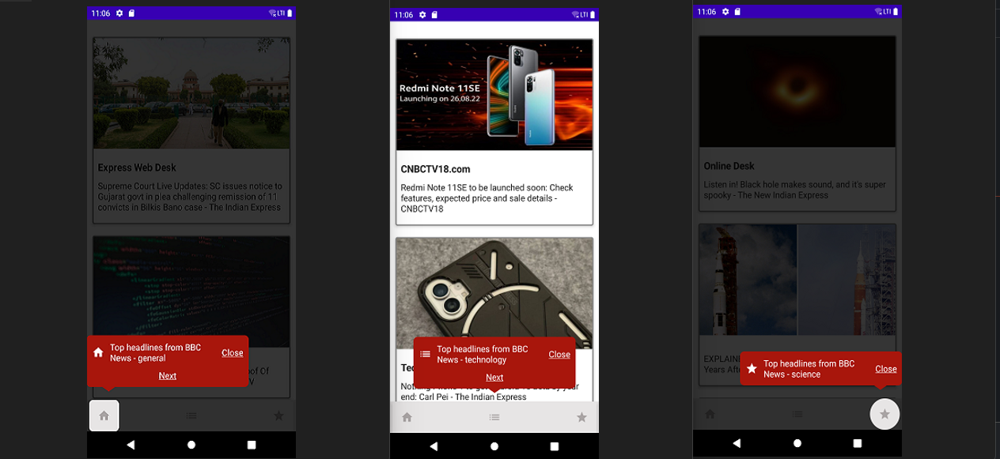

Y-Tooltip is a light and extensible tooltip library for Jetpack Compose system. It has two  modules:

 1- Tooltip (Tooltip components for Jetpack Compose)
 2- app (sample app to showcase the different usage of tooltip)
### What is a Tooltip ?

A Tooltip is the message view which appears near to anchor view, it can have title, icon, and action 
button. A Tooltip view can be used for guiding the user. 

There are two types of tooltips available:
 
 1- Tooltip screen.
 2- Tooltip view.

### TooltipScreen

When we need screen overlay for full screen then we need to use ToolTipScreen composable as parent 
component and inside we need to use ToolTipView as child component.
```kotlin
eg.
ToolTipScreen(
paddingHighlightArea = 0f // Padding highlighted area for overlay,
mainContent = {
ToolTipView ()
//main content including ToolTipView
},
anyHintVisible = //need to pass boolean value if any Tip is visible in screen,
visibleHintCoordinates = // co-ordinates to show hint,
backgroundTransparency = // To set background transparency
)
```
### ToolTipView
This component shows Tip View on click of any component, also we can pass custom click event and
custom content view to this component.
```kotlin
ToolTipView(
 visibleHintCoordinates = // co-ordinates to show hint,
 isHintVisible = //need to pass boolean value if any Tip is visible in screen,
  dismissOnTouchOutside = // true or false,
  customHintContent = {
  // custom view content
 },
 onClick = {
  // on click if multiple view on same screen 
 },
 customViewClickable = {
  // custom view clickable 
 }
)
```




### License
Copyright 2022 YML

    Licensed under the Apache License, Version 2.0 (the "License");
    you may not use this file except in compliance with the License.
    You may obtain a copy of the License at

        http://www.apache.org/licenses/LICENSE-2.0

    Unless required by applicable law or agreed to in writing, software
    distributed under the License is distributed on an "AS IS" BASIS,
    WITHOUT WARRANTIES OR CONDITIONS OF ANY KIND, either express or implied.
    See the License for the specific language governing permissions and
    limitations under the License.
